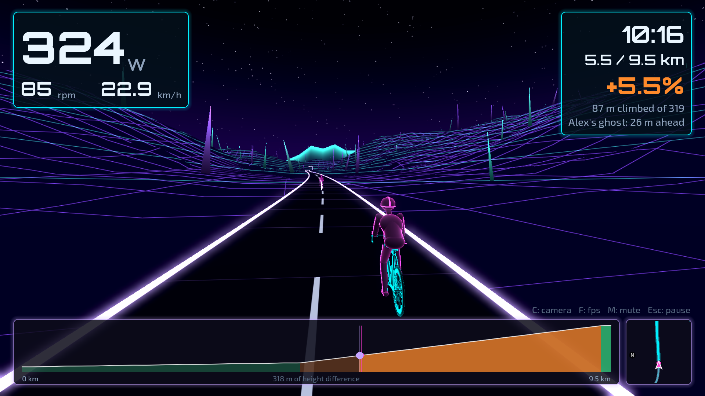
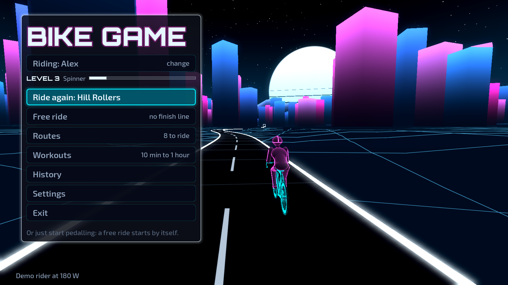
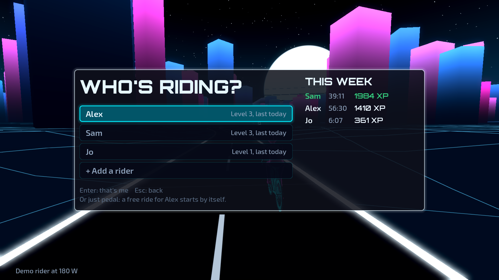
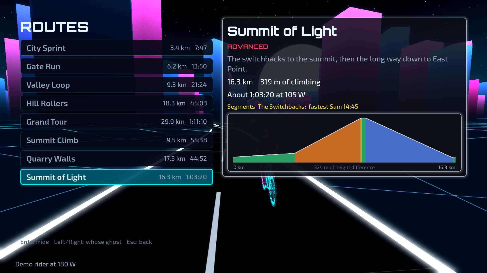
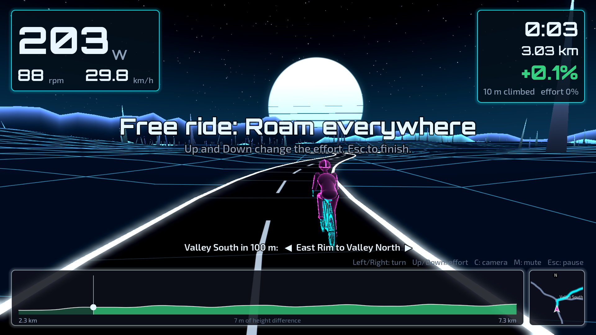
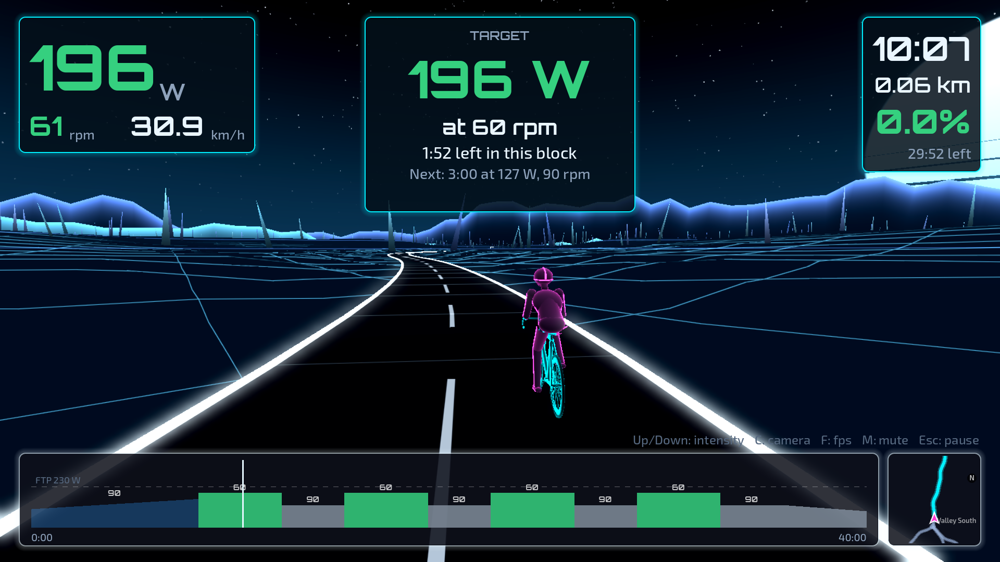
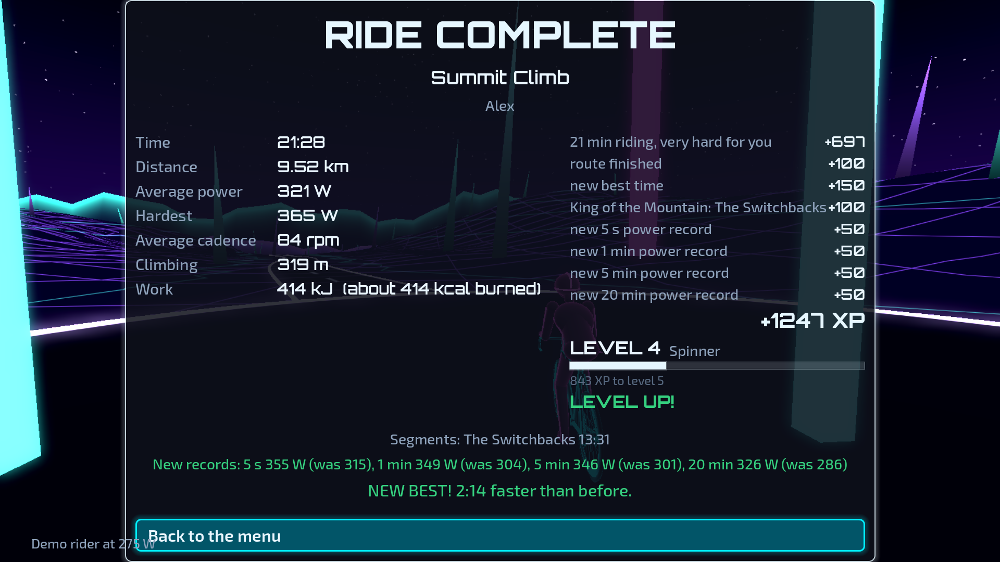
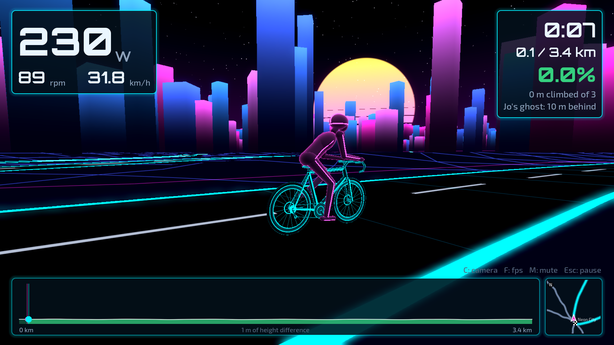

# bike-game

**A neon cycling game for Bluetooth indoor bikes and smart trainers.**
Switch on the bike and the screen, and ride. No phone, no account, no mouse:
a keyboard, a bike, and a made-up island to ride round, whose hills you feel
through the pedals.

It runs in Docker on Linux: as a window on your desktop, or as a kiosk on a
computer by the bike that boots straight into the game.



## Contents

- [What's in it](#whats-in-it)
- [Bikes](#bikes)
- [Running it](#running-it)
- [Keys](#keys)
- [If something's wrong](#if-somethings-wrong)
- [How it's built](#how-its-built)
- [Credits and licence](#credits-and-licence)

## What's in it

### An island to ride

A city of neon towers, rolling hills, a valley, a ridge, a quarry and a
mountain, joined by roads that meet at round plazas. Every ride is a way
round it, so the roads and landmarks become familiar.

- **8 routes**, from a flat lap of the city (3.3 km, about 7 minutes) to the
  30 km Grand Tour and the switchbacks up the mountain. The list shows each
  route's height profile and how long it takes at your pace.
- **7 free rides** with no finish line, beginner to advanced: laps of the
  city, the valley, the hills or the mountain, or roaming the island. When
  you roam, the next junction and the road you'll take are shown on screen,
  and Left/Right pick another. Leave it alone and a road is chosen for you.
  Just pedalling in the menu for a few seconds starts a free ride.
- **A racing-game map** beside the height profile: zoomed in round you and
  turning with you, showing your route, the plazas, the finish and the
  ghost.

### Training

- **14 workouts**, from a 10-minute first spin to hour-long sessions. The
  bike holds each target wattage for you (ERG), set from your FTP; Up/Down
  make the whole workout easier or harder.
- **Cadence targets**: some blocks also ask for a cadence, from Big Gear's
  heavy 60 rpm to Cadence Builder's 110. Your power and cadence turn green on
  target, yellow near it and red off it, with "Pedal faster/slower" when the
  cadence is off, and the summary says how much of the time you held them.
- **An FTP test**: five easy minutes, then 20 W more every minute until you
  can't keep up. Your FTP is 75% of your best minute, and you choose whether
  to use it.

### Competing

- **Ghosts**: race your own best on a route, or another rider's. It rides
  in that rider's colour, the screen shows the gap, and a banner tells you
  when one of you passes the other.
- **Segments**: The Switchbacks, Quarry Wall, West Wall, Hilltop Drag and
  Valley Sprint are timed on any ride that crosses them, with the time to
  beat as you enter, a live timer, and a King of the Mountain for the
  fastest rider.
- **Power records**: your best over 5 seconds, 1, 5 and 20 minutes,
  announced the moment you beat one.
- **XP and levels**: every ride earns XP for how hard it was *for you*,
  measured against your own FTP, so a beginner and a strong rider level up
  at the same pace for the same effort. Bonuses for finishing, new bests,
  beating other riders, records and riding on days in a row; titles from
  Rookie to Lightspeed.

### For a whole household

- **Riders**: each person gets their own name, weight, FTP, colour and
  camera, and their own history, bests, ghosts and records. With more than
  one rider, the game asks "Who's riding?" when it starts or wakes, and shows
  this week's time and XP for everyone.
- **It looks after itself**: if nobody pedals or presses a key for 3
  minutes it sleeps (a dim clock), and pedalling wakes it. Walk away
  mid-ride and after 5 minutes the ride is saved for you.
- **Sound**: synthwave music, wind and tyre noise that follow your speed,
  countdown beeps, chimes and fanfares, all generated from code.

| | |
|---|---|
|  |  |
|  |  |
|  |  |
|  | |

## Bikes

It speaks FTMS (Bluetooth Fitness Machine Service), the standard protocol of
smart bikes and trainers. It was written for, and tested with, a **Decathlon
Domyos Challenge Bike (2023)**. Other FTMS bikes and trainers should work, but
haven't been tried.

- **Hills** need the bike to take a gradient (FTMS indoor bike simulation).
- **Workouts** hold each target wattage when the bike supports it (ERG, FTMS
  target power); the menu says "holds wattages for workouts" when it does.
  Without it the workout still runs, and you match the target yourself.
- Power comes from the bike. Some bikes estimate it from resistance and
  cadence, so it can be approximate.

## Running it

```sh
git clone https://github.com/catatwo/bike-game
cd bike-game
```

You need Linux on x86-64 with Docker and Docker Compose, a Bluetooth adapter
with BlueZ running on the host (`bluetoothd`), and a graphics card with
OpenGL 3.3 (or Vulkan). It runs as two containers:

- `bridge` talks to the bike over Bluetooth, through the host's BlueZ, and
  relays it to the game on 127.0.0.1. It connects to the first bike it finds
  advertising FTMS and remembers it; to pick one by name, add
  `command: ["--name", "<part of its name>"]` to it in `compose.yaml`.
- the game, as a window or as a kiosk:

### On a Linux desktop

```sh
docker compose --profile desktop up --build
```

The game opens as a window in your Wayland session, with sound through
PipeWire or PulseAudio. Ctrl+C stops it. It runs as uid 1000; if yours is
different, change `user:` under `game` in `compose.yaml`. Away from the bike,
ride with a made-up rider (see [Handy options](#handy-options)).

### Kiosk: a computer at the bike

For a computer that does nothing but the game: switch it on, and it's there.

```sh
docker compose --profile kiosk up -d --build
```

- **No desktop may be running on it.** The game brings its own compositor
  (cage), draws straight onto the screen at its fastest refresh rate, reads
  the keyboard itself, and plays through the first USB sound card it finds.
- Both containers restart with Docker, so with Docker enabled at boot the
  computer starts straight into the game.
- Mask the login prompt on the screen (`sudo systemctl mask getty@tty1`), so
  keys typed at the game don't also land in a login underneath it.
- The menu's **Exit** ends the game, and Docker starts it again. To make Exit
  shut the computer down instead, put this in a `compose.override.yaml` next
  to `compose.yaml` (Docker Compose reads it by itself, and git ignores it),
  then `docker compose --profile kiosk up -d`:

  ```yaml
  services:
    kiosk:
      environment:
        EXIT_ACTION: poweroff
  ```

  Only the Exit button does it: Ctrl+Q, a crash or Docker stopping the game
  never power off.

Rides and settings are kept in `data/` next to this file, one numbered folder
per rider in `data/bike-game/riders/`.

## Keys

| In the menus | |
|---|---|
| Up / Down | move |
| Enter | pick |
| Left / Right | change a setting; on a route, whose ghost to race |
| Esc | back |

| Riding | |
|---|---|
| Up / Down | free ride: effort; workout: intensity |
| Left / Right | roaming: pick the road at the next junction |
| C | camera: behind, side, rider's eyes |
| F | frames per second on/off |
| M | sound off/on (in the menus too; remembered) |
| Esc | pause: keep riding, finish and save, or quit without saving |
| Ctrl+Q | quit the game (in kiosk mode it starts again by itself) |

## If something's wrong

- **Black screen.** Look at `docker compose logs kiosk`. If a desktop is
  running, the game can't have the screen. If the log shows a graphics error,
  try the other renderer: add `GAME_RENDERER: vulkan` under the kiosk's
  `environment:`, then `docker compose --profile kiosk up -d`.
- **No sound.** `cat /proc/asound/cards` lists the cards. The game picks the
  first `USB-Audio` one; to pick another, add `AUDIO_CARD: "<number>"` under
  the kiosk's `environment:`. Plug the speaker in before the game starts, or
  `docker compose restart kiosk` afterwards.
- **The keyboard does nothing.** Plug it in, then
  `docker compose restart kiosk`.
- **Jerky, or stuck at 60 fps.** Press F during a ride to see the frame rate.
  The kiosk log says which mode it set (`bike-game: DP-3 at 1920x1080, 144 Hz`);
  `GAME_MODE: 1920x1080@120` under the kiosk's `environment:` forces one.
  Settings → Graphics: Low turns off the glow and draws at a lower resolution.
- **"Switch on the bike", and it is on.** `docker compose logs bridge` shows
  it searching and finding the bike. Only one thing can be connected to the
  bike at a time: not a phone app, and not another computer running this.
- **"No Bluetooth adapter found".** The host has no adapter, or BlueZ isn't
  running: `bluetoothctl list` on the host should show one. The bridge keeps
  trying, and picks the adapter up once it appears.

## How it's built

- `bridge/`: Python and `bleak`. It speaks FTMS to the bike and relays it to
  the game over UDP on 127.0.0.1: readings in, gradient or target wattage
  out. The message format is at the top of `bridge/bikebridge.py`; the byte
  layouts were cross-checked against Auuki's (`src/ble/ftms/` in
  dvmarinoff/Auuki).
- `game/`: Godot 4.7 and GDScript, on the Compatibility renderer (OpenGL).
  Everything is built from code: the island, the bike and rider from glowing
  tubes, the menus and the HUD.
  - The island (`scripts/island.gd`) is its places and the roads between
    them, laid out by hand; the bends, hills and land between the roads are
    generated from that. The land's heights are worked out when the image is
    built (`tools/bake_island.gd`, a few seconds) and drawn in tiles round the
    camera.
  - A route (`route.gd`) is a list of roads ridden one after another, joined
    across the plazas; `ride.gd` is a ride's logic, with no drawing, so it can
    be tested; `rider_physics.gd` turns watts into speed.
  - Routes, workouts and colours are in `catalog.gd`; XP and levels in
    `levels.gd`; the screens in `main.gd`, `menu.gd`, `hud.gd`, `world.gd`
    and `minimap.gd`.
- `game/run.sh` starts it, and in kiosk mode runs cage with
  `game/kiosk-client.sh`, which sets the refresh rate and starts Godot.
- `tools/make_sounds.py`: every sound, from code (standard library only).
- `TODO.md`: ideas not built yet.

### Tests

- `docker compose build` runs everything. The bridge's tests run in its
  image. The game's tests (physics, the island, routes, workouts, rides,
  saving, XP, the link to the bike) run in its image, followed by a few
  seconds of a route, a workout and a free ride with a made-up rider, and
  checks of the Exit button and of walking away from a ride. Any failure or
  script error stops the build.
- Without Docker: `cd bridge && python3 -m unittest`, and
  `godot --headless --path game --script res://tests/run.gd` (after one
  `godot --headless --path game --import`).

### Handy options

Game options go after `--`, which comes after the service or image name in
Docker, for example
`docker compose --profile desktop run --rm game -- --demo=200`:

| | |
|---|---|
| `--demo=200` | a made-up rider at 200 W, no bike needed |
| `--demo-max=260` | the most the made-up rider can push, to try the FTP test |
| `--demo-rpm=90` | the made-up rider's cadence, whatever a workout asks for |
| `--rider=Sam` | ride as Sam (added if missing), without asking who's riding |
| `--ride=route:city-sprint` | start riding at once (`workout:pyramid`, `free:roam-all`, ...) |
| `--at=4200` / `--elapsed=600` | start that far along / that far into the ride |
| `--screen=routes` | open a menu screen (`workouts`, `free`, `history`, `settings`, `riders`, `pause`, `summary`, `sleep`) |
| `--view=1` | camera: 0 behind, 1 side, 2 rider's eyes |
| `--keys=down,enter,esc` | press keys, one every 0.4 s (a single letter types it: `enter,S,a,m,enter`) |
| `--time-scale=40` | run the ride clock 40 times faster |
| `--walk-away=10` / `--sleep-after=10` | shorten the walk-away and sleep waits |
| `--screenshot=/data/x.png --after=5` | save a picture and quit |
| `--quit-after=20` | quit after that many seconds |

The bridge: `docker compose run --rm bridge --fake` pretends to be a bike,
and `docker compose run --rm bridge -v --hill-test` (at the bike, no game)
prints readings and changes the gradient every 20 s.

Screenshots without a screen, as in `docs/screenshots/`: run the image under
`xvfb-run` with `--init`, `--rendering-driver opengl3` and the options above.
Without `--init`, `xvfb-run` becomes the container's first process and hangs
forever waiting for the virtual screen.

## Credits and licence

bike-game is free software under the [MIT licence](LICENSE).

- [Godot Engine](https://godotengine.org) (MIT), downloaded when the image is
  built.
- [bleak](https://github.com/hbldh/bleak) (MIT) for Bluetooth.
- Fonts: Exo 2 and Orbitron, under the SIL Open Font License (`game/fonts/`).
